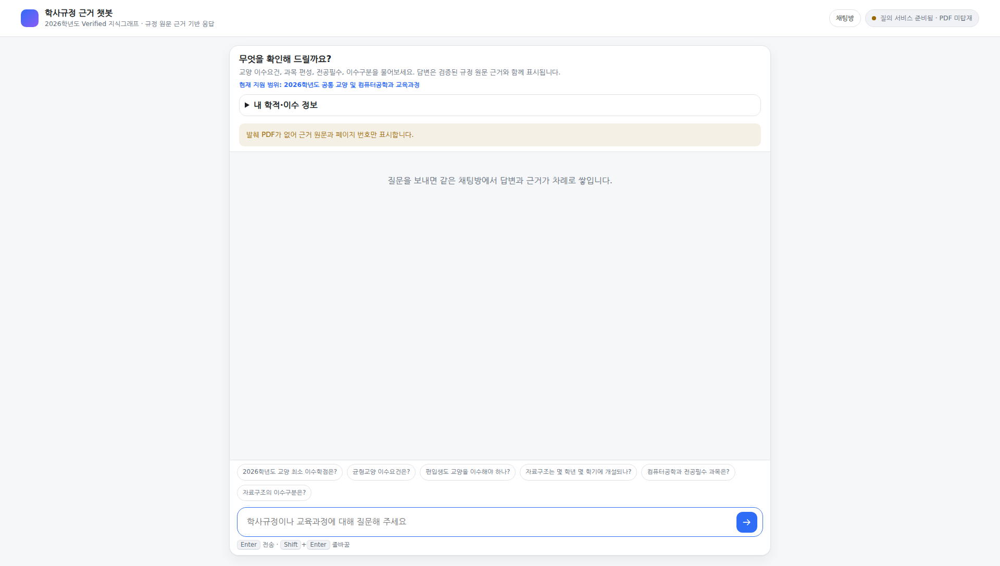
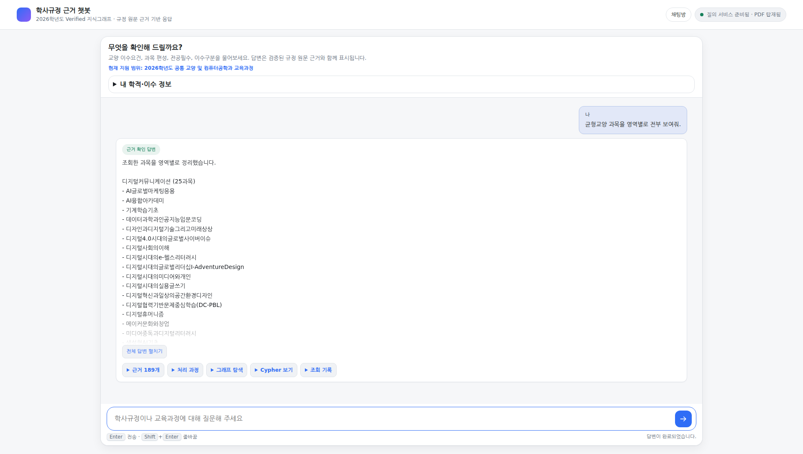
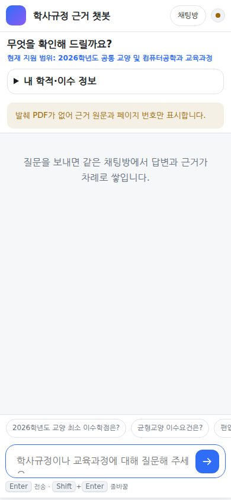
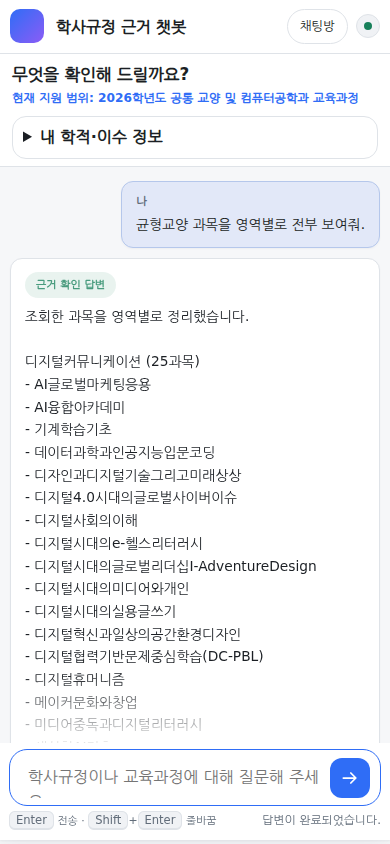

# PR #37 긴 목록·정정·브라우저 회귀

> Draft PR #37의 실제 `/api/ask` SSE와 Chromium 화면을 기준으로 수행한 후속 회귀다.
> 질문과 기대값은 평가·테스트 계층에만 있으며 런타임 분기로 사용하지 않는다.

## 재현과 원인

`균형교양 과목을 영역별로 전부 보여줘.`는 수정 전 4개 자식 영역을 서로 다른 전체
질의로 실행했다. 189개 원시 결과와 Citation을 네 번의 planner·Cypher·검증·답변 경로로
합치고 다시 LLM FactPacket에 넣으면서 실제 SSE가 약 180초 걸렸다. 브라우저의 180초
대기 제한에 도달하면 사용자는 `SAFE_FAILURE`만 보게 됐다. 데이터나 Evidence가 없는
문제가 아니며 timeout을 늘려 해결하지 않았다.

같은 메시지에서 `전공 42학점` 뒤에 `전공은 45학점이야. 다시 계산해줘.`라고 명시해도
기존 extractor는 동일 category의 서로 다른 값을 순서 없는 집합으로 모았다. 따라서 뒤의
값과 정정 cue를 연결하지 못하고 충돌 clarification을 만들었다.

## 긴 목록 처리 계약

- parent `area_ids`를 사용하는 승인 QueryPlan 하나로 네 실제 자식 영역을 조회한다.
- 일반 질의는 100행 ceiling을 유지하고 `COURSE_LIST`에만 250행 hard limit을 적용한다.
- ResultValidator가 승인한 stable Course identity로 중복을 제거하고, 실제
  `EducationArea.name_ko`로 Python renderer가 전체 목록을 그룹화한다.
- LLM에는 영역 수와 고유 과목 수만 전달한다. 전체 이름·행·Citation은 prompt에 다시
  넣지 않고 결정론적으로 보존한다.
- Citation은 189건 모두 turn snapshot에 남지만 disclosure를 열 때만 DOM을 만든다.
- traversal은 승인된 572 nodes / 756 edges를 보존한다. 기본 화면은 실제 영역별 개수만
  그리며 `전체 노드 표시`를 누른 경우에만 SVG를 만든다.

실제 KG 결과는 다음과 같다.

| 영역 | 고유 과목 수 |
|---|---:|
| 디지털커뮤니케이션 | 25 |
| 사회와문화 | 66 |
| 인문예술 | 58 |
| 자연·과학·기술의이해 | 40 |
| 합계 | 189 |

## 정정 처리

동일 category의 값이 여러 개면 기본적으로 clarification을 유지한다. 다만 `아니라`,
`정정`, `실제로는`, `잘못 말했어`, `바꿀게`, `아니,`, `다시 계산`, `로 계산해줘`처럼
명시적인 cue가 값 사이에 있으면 같은 메시지에서 뒤에 나온 최신 값을 채택한다. category를
생략한 replacement도 cue 앞의 가장 가까운 category가 하나일 때만 연결한다. 계산은 최신
프로필에서 Python이 전부 다시 수행한다.

## 레이아웃 전후

수정 전 앱 셸은 최대 1,040px이고 입력창 위에 추천 질문 6개가 별도 focus·스크롤 영역으로
있었다. 수정 후 셸은 가용 폭을 최대 1,440px까지 사용하고 일반 본문은 78ch, 일반
assistant/user message는 각각 75%/62%, 긴 목록은 100% 폭을 사용한다. 추천 질문의 HTML,
JavaScript, CSS, focus 대상과 health payload를 제거했다. transcript 하나만 주 스크롤로
사용하며 composer와 `최신 메시지 보기`가 답변을 덮지 않는다.

| 화면 | 수정 전 | 수정 후 |
|---|---|---|
| desktop 1920×1080 |  |  |
| mobile 390×844 |  |  |

## Chromium viewport 결과

| viewport | 앱 셸 폭 | composer 상태 | 가로 overflow |
|---|---:|---|---|
| 390×844 | 390px | viewport 안 | 없음 |
| 768×1024 | 720px | viewport 안 | 없음 |
| 1280×720 | 1,203px | viewport 안 | 없음 |
| 1440×900 | 1,354px | viewport 안 | 없음 |
| 1920×1080 | 1,440px | viewport 안 | 없음 |
| 2048×1152 | 1,440px | viewport 안 | 없음 |

Chromium에서 189개 Evidence disclosure의 lazy DOM 생성은 약 106ms, 전체 traversal
SVG의 명시적 렌더링은 약 329ms였다. 최초 화면은 영역 요약만 그린다. 189개 bullet,
PDF modal, 처리 과정 disclosure, 895자 canonical Cypher와 reload 복원을 확인했고 SSE의
실제 완료 단계는 10개였다. console
error와 page error는 최종 화면에서 모두 0건이다. CSE 전체 목록도 16.080초에 37개
bullet과 `전공선택 28 / 전공필수 9`, Citation 37건으로 표시됐다.

## 자동·실서비스 검증

PR #10 원본 50문항은 최신 Head 서버에서 문항별 빈 대화로 처음부터 실행했다. 기대 상태
50/50, 평균/P50/P95 `13.572/17.099/24.751초`, `ANSWERED` Citation 22/22,
공개 오류·SAFE_FAILURE 0이었다. 미공개 50문항은 이전 상태 분포와 50/50 일치했고
평균/P50/P95 `14.644/14.575/49.376초`, Citation 30/30이었다. 다중 턴 20개·65턴도
이전 상태 전이와 65/65 일치했고 `13.783/14.704/29.164초`, Citation 43/43이었다.
전체 115턴의 공개 오류·SAFE_FAILURE와 canonical fallback은 0건이다. 상세 결과는
[Agentic GraphRAG 일반화 평가](agentic-graphrag-v1.md)에 기록했다. 실행하지 않은 항목은
통과로 표시하지 않는다.
