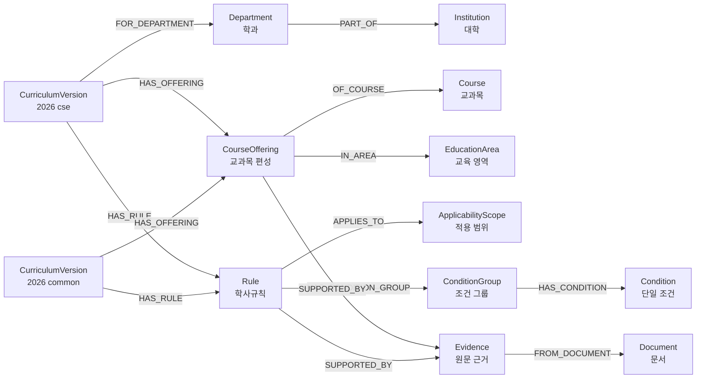

# 2026 학사 교육과정 온톨로지 V1 설계

| 항목 | 내용 |
|---|---|
| 상태 | Draft |
| 버전 | 0.1.0 |
| 기준 데이터 | 2026 교양 이수요건 및 컴퓨터공학과 교육과정 19쪽 |
| 저장 모델 | Neo4j Labeled Property Graph |
| 작성 담당 | 정이량 |
| 구현 기준 | [`ontology/ontology_spec.json`](../../ontology/ontology_spec.json) |

## 1. 문서 목적

이 문서는 [`ontology_spec.json`](../../ontology/ontology_spec.json)의 구조, 한글 의미, 설계 이유와 확장 방식을 사람이 읽을 수 있도록 설명한다. 별도의 스키마 원본이 아니며, 문서와 명세가 다르면 현재 구현 기준은 `ontology_spec.json`이다.

이 프로젝트의 온톨로지는 RDF/OWL 추론 파일이 아니라 Neo4j labeled property graph용 애플리케이션 스키마다. 이후 PDF 데이터 정리, Neo4j 적재, 검증, 조회 단계가 같은 라벨·관계·속성·식별자 계약을 사용하도록 하는 것이 목적이다.

## 2. 현재 적용 범위

공식 입력은 `data/raw/2026 교육과정(교양이수요건+컴공교육과정).pdf`이다.

| 발췌 PDF | 원본 PDF | 인쇄 페이지 | 내용 |
|---:|---:|---:|---|
| 1~13 | 33~45 | 25~37 | 대학 공통 교양 이수요건과 교양 교과목 |
| 14~19 | 259~264 | 251~256 | 컴퓨터공학과 교육과정과 경과조치 |

- 파일 크기: 824,216 bytes
- 페이지 수: 19
- SHA-256: `8ee5ee9d45fde0b00f8c42dc5aa513a46ec6a28bed4db50af25a049ae2dac004`
- 텍스트 레이어: 있음

현재 산출물은 스키마 설계 명세다. PDF에 적힌 전체 과목·학점·규칙을 담은 실제 데이터 JSON은 아직 생성하지 않았다. Neo4j 적재, Cypher, 자연어 질의응답과 전체 PDF 자동 추출도 현재 범위가 아니다.

## 3. 파일별 역할

| 파일 | 역할 | 아닌 것 |
|---|---|---|
| [`ontology/ontology_spec.json`](../../ontology/ontology_spec.json) | 2026학년도 국립창원대학교 교양 이수요건과 컴퓨터공학과 교육과정을 Neo4j Labeled Property Graph로 표현하기 위한 기계 판독형 온톨로지 스키마 설계 명세 | 실제 데이터 JSON, 표준 JSON Schema, Neo4j 적재 데이터, Cypher, RDF/OWL |
| `docs/ontology/ontology-v1.md` | `ontology_spec.json`의 한글 의미, 설계 이유와 확장 방식을 설명하는 사람용 문서 | 별도의 스키마 원본 |
| 향후 실제 데이터 JSON | PDF의 과목·학점·규칙·근거 인스턴스 | 스키마 정의 |

`ontology_spec.json`은 다음을 정의한다.

- 노드 라벨, 관계 타입과 속성
- controlled vocabulary
- 식별자와 멱등 재적재 규칙
- 검증·근거 불변조건
- 연도·학과 확장 원칙
- 현재 적용 범위와 미결정 설계 사항

## 4. 전체 그래프 개요



공통 교양 규칙을 학과별로 복제하지 않는 것을 기본안으로 확정한다.

| CurriculumVersion ID | 책임 |
|---|---|
| `curriculum:cwnu:2026:common` | 대학 공통 교양 이수요건, 면제·예외, 교양 교과목 편성 |
| `curriculum:cwnu:2026:cse` | 컴퓨터공학과 전공 학점구조, 전공 교과목 편성, 경과조치 |

컴퓨터공학과 학점구조표의 교양 합계를 common 규칙에만 둘지 CSE 집계 규칙으로도 표현할지는 `OD-001`로 남긴다.

## 5. 노드 라벨 한글 설명

| 영문 라벨 | 한글 의미 | 역할 | ID 속성 |
|---|---|---|---|
| `Institution` | 대학 | 교육기관 경계 | `institution_id` |
| `Department` | 학과 | 컴퓨터공학과와 향후 다른 학과 | `department_id` |
| `Document` | 문서 | 원본·발췌 PDF 식별 | `document_id` |
| `Evidence` | 원문 근거 | PDF 페이지·표·행·짧은 원문과 검증 상태 | `evidence_id` |
| `CurriculumVersion` | 교육과정 버전 | 연도별 대학 공통 또는 학과별 교육과정 | `curriculum_id` |
| `Course` | 교과목 | 학수번호 기반의 안정적인 과목 정체성 | `course_id` |
| `CourseOffering` | 연도·학과별 교과목 편성 | 학년·학기·학점·시수·이수구분 | `offering_id` |
| `EducationArea` | 교육 영역 | 기초·균형·확대교양과 전공 영역 계층 | `area_id` |
| `Rule` | 학사규칙 | 모든 규칙 유형의 공통 기반 | `rule_id` |
| `CreditRequirement` | 학점 이수요건 | 최소·최대·합계 학점 | `rule_id` |
| `CourseRequirement` | 과목 이수요건 | 필수·택일·과목·영역 수량 조건 | `rule_id` |
| `ExemptionRule` | 면제·예외 규칙 | 편입생·대학영어 등 일반 규칙의 예외 | `rule_id` |
| `TransitionRule` | 경과조치 | 과거 교육과정의 소급·대체·이수 해제 | `rule_id` |
| `ApplicabilityScope` | 적용 범위 | 학년도·입학·전공·학생·대학 범주 | `scope_id` |
| `ConditionGroup` | 조건 그룹 | `AND` 또는 `OR` 조건 묶음 | `condition_group_id` |
| `Condition` | 단일 조건 | 시험·점수·학생유형 등의 원자 조건 | `condition_id` |

규칙 하위 유형은 Neo4j 다중 라벨을 사용한다.

```text
(:Rule:CreditRequirement)
(:Rule:CourseRequirement)
(:Rule:ExemptionRule)
(:Rule:TransitionRule)
```

## 6. 관계 타입 한글 설명

| 관계 | 시작 → 끝 | 한글 의미 |
|---|---|---|
| `PART_OF` | `Department` → `Institution` | 학과가 대학에 소속 |
| `FROM_DOCUMENT` | `Evidence` → `Document` | 근거가 출처 문서에서 유래 |
| `FOR_DEPARTMENT` | `CurriculumVersion` → `Department` | 학과 교육과정의 대상 학과 |
| `HAS_OFFERING` | `CurriculumVersion` → `CourseOffering` | 교육과정이 편성을 포함 |
| `OF_COURSE` | `CourseOffering` → `Course` | 편성이 과목 정체성을 참조 |
| `IN_AREA` | `CourseOffering` → `EducationArea` | 편성이 교육 영역에 속함 |
| `PARENT_OF` | `EducationArea` → `EducationArea` | 상위 영역이 하위 영역을 포함 |
| `HAS_RULE` | `CurriculumVersion` → `Rule` | 교육과정이 규칙을 포함 |
| `APPLIES_TO` | `Rule` → `ApplicabilityScope` | 규칙의 적용 범위 |
| `TARGETS` | `Rule` → 과목·편성·영역·교육과정 | 규칙의 대상 |
| `HAS_CONDITION_GROUP` | `Rule` → `ConditionGroup` | 규칙의 조건 묶음 |
| `HAS_CONDITION` | `ConditionGroup` → `Condition` | 그룹의 단일 조건 |
| `OVERRIDES` | `ExemptionRule` → `Rule` | 예외 규칙이 일반 규칙보다 우선 |
| `SUPPORTED_BY` | `Rule`·`CourseOffering` → `Evidence` | 규칙·편성의 원문 근거 |

V1은 `Document-[:HAS_EVIDENCE]->Evidence`를 제거하고 `Evidence-[:FROM_DOCUMENT]->Document`만 유지한다. Neo4j는 하나의 관계를 양방향으로 탐색할 수 있으므로 같은 문서–근거 쌍을 역관계로 중복 저장할 필요가 없고, 두 관계의 불일치 위험도 피할 수 있다.

## 7. Course와 CourseOffering 분리 이유

`Course`는 학수번호를 중심으로 한 안정적인 정체성이다. 과목명은 표시 속성이며 학점·시수·학기·이수구분 같은 연도별 값은 저장하지 않는다.

`CourseOffering`은 특정 `CurriculumVersion`에서의 편성이다. 같은 학수번호가 동일 교육과정에 여러 행으로 등장할 수 있으므로 ID에 학년·학기·이수구분을 포함한다.

```text
offering:<institution>:<year>:<curriculum-code>:<course-code>:g<grade-token>:<semester>:<completion-type>

offering:cwnu:2026:cse:CDA0008:g2:FIRST:MAJOR_ELECTIVE
```

이 방식은 다른 학년·학기·이수구분의 편성 충돌을 막는다. 반면 모든 ID 구성요소가 같은 두 행은 구분하지 않는다. 이 경우 같은 논리 편성의 중복으로 간주하고, 학점·시수 등 값이 다르면 임의 variant ID를 생성하지 않고 데이터 품질 오류로 검토한다.

## 8. Rule 노드화 이유

복합 학사규칙은 문자열이나 관계 속성 하나로 저장하지 않는다.

```text
CurriculumVersion -[:HAS_RULE]-> Rule
Rule -[:APPLIES_TO]-> ApplicabilityScope
Rule -[:HAS_CONDITION_GROUP]-> ConditionGroup
ConditionGroup -[:HAS_CONDITION]-> Condition
```

공통 `Rule`의 필수 속성은 `rule_id`, `rule_type`, `status`, `description_ko`다. `operator`는 모든 하위 유형에 일괄 강제하지 않는다.

| 하위 라벨 | `operator` | 이유 |
|---|---|---|
| `CreditRequirement` | 필수 | 최소·최대·합계 학점 비교가 필요 |
| `CourseRequirement` | 필수 | 과목·영역 수량 또는 포함 조건 표현 |
| `ExemptionRule` | 선택 | 조건 그룹과 override 효과만으로 표현될 수 있음 |
| `TransitionRule` | 선택 | 복잡한 서술형 소급·대체 조치는 단일 비교 연산자로 환원되지 않을 수 있음 |

`CreditRequirement`에는 `value`와 `unit`도 필수다. 복잡한 조건은 `ConditionGroup`과 `Condition`으로 분리하며 `logic_operator`는 `AND` 또는 `OR`만 허용한다.

## 9. Evidence와 검증 상태

```text
Rule 또는 CourseOffering
→ SUPPORTED_BY
→ Evidence
→ FROM_DOCUMENT
→ Document
```

다음은 V1의 기본 정책이다.

1. `VERIFIED Rule`은 하나 이상의 `VERIFIED Evidence`와 연결돼야 한다.
2. `VERIFIED CourseOffering`도 하나 이상의 `VERIFIED Evidence`와 연결돼야 한다.
3. 사용자 답변은 원칙적으로 `VERIFIED Evidence`가 연결된 사실만 사용한다.
4. `REVIEW_REQUIRED` 사실을 진단·검토 모드에서 예외적으로 노출할지와 경고 형식은 `OD-002`로 남긴다.
5. `Evidence.raw_text`는 필요한 짧은 원문을 보존하며 정정값으로 덮어쓰지 않는다.
6. 발췌·원본·인쇄 페이지는 `excerpt_page`, `source_pdf_page`, `printed_page`로 구분한다.

검증 상태는 `DRAFT`, `REVIEW_REQUIRED`, `VERIFIED`, `REJECTED`만 허용한다. `bbox`는 확인된 경우에만 `[x0, y0, x1, y1]` 숫자 배열로 저장한다.

## 10. 식별자 규칙

| 대상 | 형식 또는 예시 |
|---|---|
| 대학 | `institution:cwnu` |
| 학과 | `department:cwnu:cse` |
| 공통 교양 교육과정 | `curriculum:cwnu:2026:common` |
| 컴퓨터공학과 교육과정 | `curriculum:cwnu:2026:cse` |
| 과목 | `course:cwnu:CDA0008` |
| 편성 | `offering:cwnu:2026:cse:CDA0008:g2:FIRST:MAJOR_ELECTIVE` |
| 교육 영역 | `area:general:balanced` |
| 규칙 | `rule:cwnu:2026:general:min-total` |
| 근거 | `evidence:<document-id>:excerpt-p<page>:<row-key>` |

- 변경 가능한 과목명과 한글 표시명을 ID에 사용하지 않는다.
- 같은 입력은 같은 ID를 계산해야 하며 재적재로 중복을 만들지 않는다.
- 문서 ID에 해시 접두사를 쓰더라도 전체 SHA-256은 속성으로 보존한다.
- 빈 값과 숫자 0을 구분하고 원문값과 정규화·정정값을 분리한다.

## 11. 새 연도·새 학과 확장 방식

### 새 연도

- `curriculum:cwnu:2027:common`, `curriculum:cwnu:2027:cse`처럼 새 `CurriculumVersion`을 만든다.
- 새 `CourseOffering`, `Rule`, `Evidence`를 만들고 학수번호 정체성이 같은 `Course`는 재사용한다.
- 기존 2026 노드와 속성을 덮어쓰지 않는다.

### 새 학과

- 새 `Department`와 `curriculum:cwnu:<year>:<department-code>`를 만든다.
- 학과별 전공 `Rule`과 `CourseOffering`을 분리한다.
- 대학 공통 교양 규칙은 `<year>:common`에서 공유하고 학과별로 복제하지 않는다.

### 다른 학사규정

`Document`, `Evidence`, `Rule`, `ApplicabilityScope`를 공통 코어로 재사용한다. 선수과목·대체과목 등 현재 PDF에 없는 값은 확장 후보일 뿐 실제 데이터로 미리 생성하지 않는다.

## 12. PoC 대표 질의

현재 단계에서는 별도 competency question fixture나 gold result JSON을 만들지 않는다. Neo4j 적재와 Cypher 조회가 아직 없어 `required_nodes`, `expected_graph_patterns`, `answerability`를 자동 판정할 실행 기반이 없기 때문이다.

PoC가 우선 답해야 할 대표 질문은 다음과 같다.

1. 2026학년도 교양 최소 이수학점은 얼마인가?
2. 대학영어 이수 면제를 받으면 해당 학점도 인정되는가?
3. 컴퓨터공학과 단일전공의 전공필수 학점은 얼마인가?
4. 자료구조는 몇 학년 몇 학기에 개설되는가?

질문 문장을 런타임에서 직접 비교해 답을 반환하지 않는다. 향후 Neo4j 적재와 Cypher 조회가 구현되면 테스트 코드와 함께 `tests/fixtures/expected_query_results.json`을 만들고, 실제 조회 결과·근거 페이지·지원 여부를 회귀 검증한다.

## 13. 현재 미결정 사항

| ID | 우선순위 | 내용 |
|---|---|---|
| `OD-001` | 높음 | CSE 학점구조의 교양 합계를 common에만 둘지 CSE 집계 규칙·참조로도 표현할지 |
| `OD-002` | 높음 | 검토 모드에서 `REVIEW_REQUIRED` 사실을 예외 노출할지와 경고 형식 |
| `OD-003` | 높음 | 경과조치 첫 문장의 원문 시각 검증 |
| `OD-004` | 중간 | 부전공 필수 표식의 `CourseRequirement` ID와 범위 |
| `OD-005` | 중간 | 동일 학수번호의 기관 내 영구 유일성 |
| `OD-006` | 중간 | `bbox` 좌표계 원점·단위·회전 규약 |
| `OD-007` | 중간 | 복수·연계·융합전공 학점구조 표의 병합 행 의미 |
| `OD-008` | 낮음 | 원문 정정값을 속성으로 둘지 별도 correction 구조로 확장할지 |

## 14. 다음 구현 단계

1. 실제 데이터 JSON 계약을 정의한다.
2. PDF에서 대표 과목·규칙·`Evidence`를 소량 작성하고 사람이 검증한다.
3. 승인된 명세를 기준으로 Neo4j 제약조건과 멱등 적재를 구현한다.
4. Cypher 조회 구현과 함께 `tests/fixtures/expected_query_results.json` 및 회귀 테스트를 작성한다.
5. 이후에만 제한된 자연어 질의와 근거 포함 답변을 구현한다.
