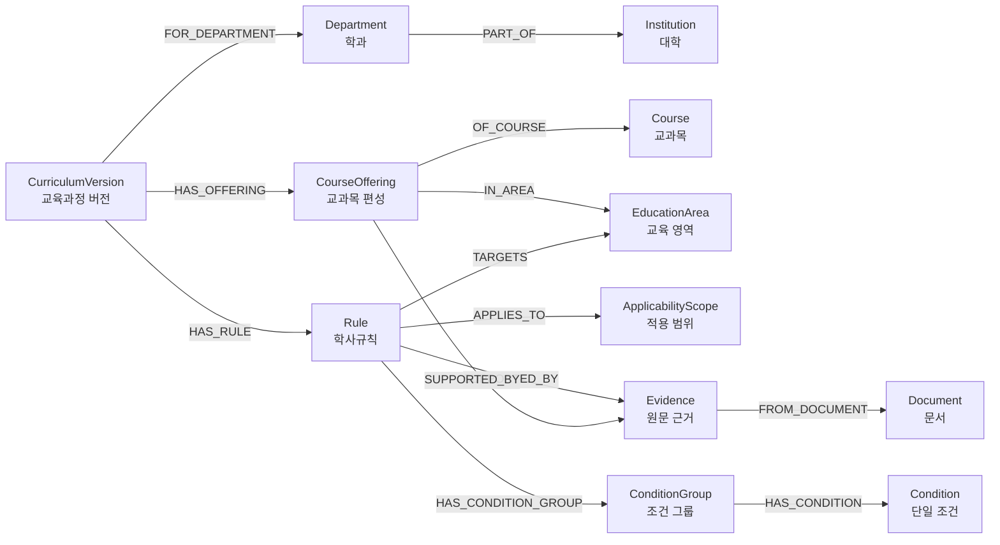

# 2026 학사 교육과정 온톨로지 V1 설계

| 항목 | 내용 |
|---|---|
| 상태 | Draft |
| 버전 | 0.1.0 |
| 기준 데이터 | 2026 교양 이수요건 및 컴퓨터공학과 교육과정 19쪽 |
| 저장 모델 | Neo4j Labeled Property Graph |
| 작성 담당 | 정이량 |

## 1. 목적

이 문서는 2026학년도 교양 이수요건과 컴퓨터공학과 교육과정을 근거 추적 가능한 그래프로 표현하기 위한 애플리케이션 온톨로지 V1을 정의한다. RDF/OWL 추론 모델이 아니라 Neo4j labeled property graph의 허용 노드, 관계, 속성, 식별자와 불변조건을 먼저 고정하는 것이 목적이다.

V1은 현재 19쪽 PDF를 정확히 표현하면서 다른 학년도·학과·학사규정으로 확장할 수 있어야 한다. 확장성은 아직 없는 데이터를 미리 생성하는 방식이 아니라 버전, 안정적 식별자, `Rule`(학사규칙), `ApplicabilityScope`(적용 범위), `Evidence`(원문 근거)를 분리하는 방식으로 확보한다.

## 2. 현재 범위

공식 입력은 `data/raw/2026 교육과정(교양이수요건+컴공교육과정).pdf`이다.

| 발췌 PDF 페이지 | 원본 PDF 페이지 | 인쇄 페이지 | 확인한 내용 |
|---|---:|---:|---|
| 1~13 | 33~45 | 25~37 | 교양 이수요건과 교양 교과목 표 |
| 14~19 | 259~264 | 251~256 | 컴퓨터공학과 교육과정, 편성표, 경과조치 |

- 파일 크기: 824,216 bytes
- SHA-256: `8ee5ee9d45fde0b00f8c42dc5aa513a46ec6a28bed4db50af25a049ae2dac004`
- 페이지 수: 19
- 텍스트 레이어: 있음. PDF의 `ToUnicode`와 content stream에서 한글·영문·숫자 텍스트를 확인했다.
- 페이지 매핑: 발췌 1쪽의 인쇄 25쪽, 발췌 14쪽의 인쇄 251쪽, 발췌 19쪽의 인쇄 256쪽이 선언된 매핑과 일치했다. 원본 PDF는 이미지 중심 구조여서 현재 설치 도구만으로 원본 페이지 텍스트를 직접 대조하지 못했다.

V1은 스키마와 확인된 대표 규칙만 다룬다. 전체 교양 교과목 자동 추출, 정제 데이터셋, Neo4j 적재, 제약조건 Cypher, 사용자 질의 실행은 범위 밖이다.

## 3. 대표 사용자 질문

| # | 질문 | 필요한 노드 | 관계 경로 | 적용 범위 | 예상 결과 | 필요한 근거 | V1 답변 가능 | 남은 결정 |
|---:|---|---|---|---|---|---|---|---|
| 1 | 2026학년도 교양 최소 이수학점은? | `CurriculumVersion`, `CreditRequirement`, `ApplicabilityScope` | `HAS_RULE`, `APPLIES_TO`, `TARGETS`, `SUPPORTED_BY` | 2026, 일반 적용 범위 | 최소 34학점 | 발췌 1/원본 33/인쇄 25 | 가능 | 공통 교양 curriculum 분리 방식 |
| 2 | 교양 최대 인정학점은? | `CreditRequirement`, `EducationArea`, `ApplicabilityScope` | `TARGETS`, `APPLIES_TO`, `SUPPORTED_BY` | 일반 42, 예술대학 50 | 범위별 최대값 | 발췌 1/원본 33/인쇄 25 | 가능 | 대학 범주 코드 체계 |
| 3 | 기초교양에서 어떤 영역을 이수해야 하는가? | `EducationArea`, `CourseRequirement`, `ConditionGroup` | `PARENT_OF`, `TARGETS`, `HAS_CONDITION_GROUP` | 2026 교양 | 미래설계·AI융합기초·열린사고와표현·글로벌의사소통 | 발췌 1/원본 33/인쇄 25 | 가능 | 택일 규칙의 정제 단위 |
| 4 | 균형교양은 몇 개 영역에서 이수해야 하는가? | `CourseRequirement`, `EducationArea` | `TARGETS`, `SUPPORTED_BY` | 2026 교양 | 4개 영역에서 영역별 1과목 이상, 총 12학점 | 발췌 1/원본 33/인쇄 25 | 가능 | 과목 중복 인정 정책 |
| 5 | 편입생도 교양 이수 의무가 있는가? | `ExemptionRule`, `ApplicabilityScope` | `APPLIES_TO`, `OVERRIDES`, `SUPPORTED_BY` | `admission_type=TRANSFER` | 교양 이수 의무 없음 | 발췌 1/원본 33/인쇄 25 | 가능 | 편입 유형 세분화 여부 |
| 6 | 대학영어 면제 시 학점도 인정되는가? | `ExemptionRule`, `ConditionGroup`, `CreditRequirement` | `HAS_CONDITION_GROUP`, `OVERRIDES`, `SUPPORTED_BY` | 공인영어 기준 충족자 | 이수만 면제되며 학점은 인정되지 않음 | 발췌 1/원본 33/인쇄 25 | 가능 | 시험 점수 조건의 별도 데이터 입력 방식 |
| 7 | 컴퓨터공학과 단일전공의 전공필수 학점은? | `CurriculumVersion`, `CreditRequirement`, `ApplicabilityScope` | `HAS_RULE`, `APPLIES_TO`, `SUPPORTED_BY` | 2026, CSE, 단일전공 | 21학점 | 발췌 16/원본 260/인쇄 252 | 가능 | 최소전공·심화전공 집계 표현 |
| 8 | 컴퓨터공학과 전공필수 과목은? | `CourseOffering`, `Course` | `HAS_OFFERING`, `OF_COURSE`, `SUPPORTED_BY` | 2026 CSE | 편성표의 `전공필수` 목록 | 발췌 17~18/원본 262~263/인쇄 254~255 | 스키마 가능, 데이터 적재 필요 | 부전공 필수 표식의 별도 규칙화 |
| 9 | 자료구조는 몇 학년 몇 학기에 개설되는가? | `Course`, `CourseOffering` | `OF_COURSE`, `SUPPORTED_BY` | 2026 CSE | 2학년 1학기 | 발췌 17/원본 262/인쇄 254 | 가능 | 없음 |
| 10 | 컴퓨터공학과의 과거 교육과정 경과조치는 무엇인가? | `TransitionRule`, `ApplicabilityScope` | `APPLIES_TO`, `TARGETS`, `SUPPORTED_BY` | 적용연도 구간별 | 구간별 소급 학점·면제·대체 규칙 | 발췌 19/원본 264/인쇄 256 | 부분 가능 | 첫 번째 경과조치 문장의 원문 재검증 |

## 4. 설계 원칙

1. 스키마에 선언되지 않은 라벨·관계 타입은 생성하지 않는다.
2. `Course`(교과목 정체성)와 `CourseOffering`(연도·학과별 편성)을 분리한다.
3. 복합 학사규칙은 문자열 속성 하나가 아니라 `Rule`과 조건 노드로 표현한다.
4. 모든 확정 `Rule`과 `CourseOffering`은 하나 이상의 `Evidence`를 가진다.
5. 발췌·원본·인쇄 페이지를 별도 속성으로 유지한다.
6. 빈 값은 숫자 0과 다르며 임의 기본값을 삽입하지 않는다.
7. 다른 연도 데이터는 새 버전 노드로 추가하고 기존 버전을 덮어쓰지 않는다.
8. 동일 입력의 재적재는 같은 ID를 사용해 중복을 만들지 않아야 한다.

## 5. 전체 그래프 구조



`PART_OF`의 방향은 `(:Department)-[:PART_OF]->(:Institution)`이며 모든 관계 방향은 관계 표를 기준으로 한다.

## 6. 노드 라벨

속성명은 영어 `snake_case`, 표시 설명은 한글을 사용한다. `—`는 선택 속성이 없다는 뜻이 아니라 아래 공통 선택 필드 또는 향후 확장 필드를 사용할 수 있음을 뜻한다.

| 라벨 | 한글 의미·책임 | 필수 속성 | 주요 선택 속성 | 고유 식별자 / 예시 | PDF 사용과 확장 역할 |
|---|---|---|---|---|---|
| `Institution` | 대학. 교육기관 경계 | `institution_id`, `name_ko` | `name_en` | `institution_id` / `institution:cwnu` | 현재 대학과 향후 기관 구분 |
| `Department` | 학과 | `department_id`, `name_ko` | `name_en` | `department_id` / `department:cwnu:cse` | 컴퓨터공학과 및 다른 학과 추가 |
| `Document` | 원본·발췌 문서 식별 | `document_id`, `title`, `academic_year`, `file_name`, `sha256`, `page_count`, `document_type` | — | `document_id` / `document:2026-curriculum-excerpt:8ee5ee9d45fd` | 파일이 바뀌면 별도 문서 ID |
| `Evidence` | 페이지·표·행·원문 근거 | `evidence_id`, `excerpt_page`, `source_pdf_page`, `printed_page`, `raw_text`, `verification_status` | `section_title`, `table_name`, `row_key`, `bbox` | `evidence_id` / `evidence:document:2026-curriculum-excerpt:8ee5ee9d45fd:excerpt-p17:CDA0008` | 규칙·편성의 근거 단위 |
| `CurriculumVersion` | 연도·학과별 교육과정 버전 | `curriculum_id`, `academic_year`, `version_name`, `status` | `effective_from`, `effective_to` | `curriculum_id` / `curriculum:cwnu:2026:cse` | 연도·학과마다 새 노드 |
| `Course` | 학수번호 기반 안정적 교과목 정체성 | `course_id`, `course_code`, `name_ko` | `name_en` | `course_id` / `course:cwnu:CDA0008` | 이름 변경과 편성 변경 분리 |
| `CourseOffering` | 특정 교육과정의 학점·시수·학기·이수구분 | `offering_id`, `grade_year`, `semester`, `credits`, `lecture_hours`, `practice_hours`, `completion_type`, `status` | `competency`, `source_value`, `normalized_value`, `correction_note` | `offering_id` / `offering:cwnu:2026:cse:CDA0008` | 연도·학과별 새 편성 |
| `EducationArea` | 기초·균형·확대·전공 등 영역 | `area_id`, `area_type`, `name_ko` | `name_en` | `area_id` / `area:general:balanced` | `PARENT_OF`로 계층화 |
| `Rule` | 모든 학사규칙의 공통 기반 | `rule_id`, `rule_type`, `operator`, `status`, `description_ko` | `value`, `unit`, `priority`, `source_value`, `normalized_value`, `correction_note` | `rule_id` / `rule:cwnu:2026:general:min-total` | 공통 탐색·버전·근거 연결 |
| `CreditRequirement` | 최소·최대·합계 학점 규칙 | `Rule` 필수 속성 | `value`, `unit` | `rule_id` / `rule:cwnu:2026:cse:single-major-required` | `Rule` 다중 라벨 |
| `CourseRequirement` | 필수·택일·과목 수 조건 | `Rule` 필수 속성 | `value`, `unit` | `rule_id` / `rule:cwnu:2026:general:balanced-four-areas` | `Rule` 다중 라벨 |
| `ExemptionRule` | 면제·학생군 예외 | `Rule` 필수 속성 | `priority` | `rule_id` / `rule:cwnu:2026:general:transfer-exemption` | 일반 규칙을 `OVERRIDES` |
| `TransitionRule` | 과거 교육과정 소급·대체·해제 | `Rule` 필수 속성 | `priority` | `rule_id` / `rule:cwnu:2026:cse:transition:2021-2024` | 적용연도 구간을 scope로 분리 |
| `ApplicabilityScope` | 연도·학과·학생·전공 유형 범위 | `scope_id`, `academic_year` | `admission_type`, `major_type`, `student_type`, `college_category` | `scope_id` / `scope:cwnu:2026:regular:single-major:cse` | 현재 없는 값은 생성하지 않고 필드만 허용 |
| `ConditionGroup` | `AND` 또는 `OR` 조건 묶음 | `condition_group_id`, `logic_operator` | — | `condition_group_id` / `condition-group:cwnu:2026:english-waiver:any-test` | 복합 조건 재사용 방지, 규칙별 소유 |
| `Condition` | 시험·점수·학생유형 등 단일 조건 | `condition_id`, `subject_field`, `operator`, `value` | `unit` | `condition_id` / `condition:cwnu:2026:english-waiver:toeic` | 원자 조건 표현 |

규칙 하위 유형은 Neo4j 다중 라벨을 사용한다.

```text
(:Rule:CreditRequirement)
(:Rule:CourseRequirement)
(:Rule:ExemptionRule)
(:Rule:TransitionRule)
```

`bbox`는 선택 속성인 숫자 배열 `[x0, y0, x1, y1]`로 저장한다. Neo4j 속성이 원시값 배열을 지원하고 JSON 직렬화가 단순하며, 네 개의 좌표 필드를 모든 근거에 강제하지 않아도 되기 때문이다. 좌표계와 단위는 `Document.document_type`별 수집 규약에서 고정해야 하며, 좌표를 확인하지 못한 근거에는 `bbox`를 만들지 않는다.

## 7. 관계 타입

| 관계 | 시작 → 끝 | 카디널리티 | 의미와 실제 PDF 예 | 허용되지 않는 사용 |
|---|---|---|---|---|
| `PART_OF` | `Department` → `Institution` | N:1 | 컴퓨터공학과가 대학에 소속 | 교육 영역 계층에 사용 금지 |
| `HAS_EVIDENCE` | `Document` → `Evidence` | 1:N | 발췌 PDF가 페이지·행 근거를 포함 | 규칙에서 직접 문서로 연결 금지 |
| `FROM_DOCUMENT` | `Evidence` → `Document` | N:1 | 근거의 출처 문서 | 근거 없는 문서 연결 금지 |
| `FOR_DEPARTMENT` | `CurriculumVersion` → `Department` | N:1 | 2026 CSE 교육과정 | 공통 교양의 귀속을 임의 확정 금지 |
| `HAS_OFFERING` | `CurriculumVersion` → `CourseOffering` | 1:N | 2026 CSE 편성표 행 | `Course`에 직접 연결 금지 |
| `OF_COURSE` | `CourseOffering` → `Course` | N:1 | 2026 자료구조 편성이 `CDA0008` 참조 | 학점·학기를 관계에 저장 금지 |
| `IN_AREA` | `CourseOffering` → `EducationArea` | N:1 이상 | 편성이 전공선택 또는 교양 영역에 속함 | 과목 정체성에 연도별 영역 고정 금지 |
| `PARENT_OF` | `EducationArea` → `EducationArea` | 1:N | 교양 → 기초·균형·확대교양 | 순환 계층 금지 |
| `HAS_RULE` | `CurriculumVersion` → `Rule` | 1:N | 2026 버전의 학점·면제 규칙 | 버전 없는 확정 규칙 금지 |
| `APPLIES_TO` | `Rule` → `ApplicabilityScope` | N:1 이상 | 단일전공·편입생·적용연도 범위 | 범위 속성을 규칙 설명문에만 숨기지 않음 |
| `TARGETS` | `Rule` → `Course` / `CourseOffering` / `EducationArea` / `CurriculumVersion` | N:M | 교양 최소학점이 교양 영역을 대상으로 함 | `Evidence`를 대상으로 사용 금지 |
| `HAS_CONDITION_GROUP` | `Rule` → `ConditionGroup` | 1:N | 영어 면제의 시험 조건 묶음 | 단일 문자열 조건으로 대체 금지 |
| `HAS_CONDITION` | `ConditionGroup` → `Condition` | 1:N | TOEIC 등 개별 조건 | 그룹 밖 조건 연결 금지 |
| `OVERRIDES` | `ExemptionRule` → `Rule` | N:M | 편입생 면제가 일반 교양 의무보다 우선 | 근거 없이 임의 우선순위 생성 금지 |
| `SUPPORTED_BY` | `Rule` / `CourseOffering` → `Evidence` | N:M, VERIFIED 시 1 이상 | 학점구조 또는 편성표 행 근거 | `VERIFIED`인데 근거가 없는 상태 금지 |

`HAS_EVIDENCE`와 `FROM_DOCUMENT`는 역방향 탐색 편의를 위한 쌍이다. 둘을 함께 저장한다면 동일한 문서·근거 쌍을 가리키도록 적재 검증이 필요하다.

## 8. Rule과 적용 범위

복합 학사규칙은 다음 구조를 사용한다.

```text
CurriculumVersion
→ HAS_RULE
→ Rule
→ APPLIES_TO
→ ApplicabilityScope
```

`rule_type`, `operator`, `value`, `unit`은 계산 가능한 핵심을 표현하고 `description_ko`는 사람이 읽는 설명이다. 적용 학년도, 전공 유형, 입학 유형 같은 범위 정보는 `Rule`에 반복 저장하지 않고 `ApplicabilityScope`로 분리한다. 확정 `Rule`은 하나 이상의 `CurriculumVersion` 연결 또는 명시적 적용 범위 연결을 가져야 한다.

## 9. 조건·면제·예외

조건이 있는 규칙은 다음과 같이 표현한다.

```text
Rule
→ HAS_CONDITION_GROUP
→ ConditionGroup
→ HAS_CONDITION
→ Condition
```

`ConditionGroup.logic_operator`는 `AND` 또는 `OR`만 허용한다. 영어 공인시험 중 어느 하나의 기준을 만족하는 경우처럼 대안 조건은 `OR` 그룹으로, 학생유형과 점수 조건을 동시에 만족해야 하는 경우는 `AND` 그룹으로 표현한다.

예외는 다음 구조를 사용한다.

```text
(:Rule:ExemptionRule)
→ OVERRIDES
→ (:Rule)
```

편입생 교양 이수 의무 면제와 대학영어 이수 면제는 같은 `ExemptionRule` 유형이지만 적용 범위와 효과가 다르다. 대학영어 면제는 학점을 부여하지 않으므로 교양 최소 34학점 충족 규칙을 없애지 않는다.

## 10. 시계열 모델

### 과목 정체성

`Course`는 학수번호 기반의 안정적인 정체성이다. 변경 가능한 학점·시수·학기·이수구분은 저장하지 않는다.

### 연도별 편성

`CourseOffering`은 교육기관 + 학과 + 교육과정 연도 + 과목의 복합 범위를 가진다.

```text
offering:cwnu:2026:cse:CDA0008
```

2027년에 자료구조의 학점이나 이수구분이 바뀌면 2026 편성을 수정하지 않고 새 `CourseOffering`을 만든다.

### 규칙 버전

모든 `Rule`은 `CurriculumVersion`에 연결한다. 새 연도 규칙은 새 ID를 사용하고 과거 규칙을 덮어쓰지 않는다.

### 다른 학과

학과마다 별도 `CurriculumVersion`을 생성한다. 동일한 `Course`를 공유할 수 있지만 `CourseOffering`은 학과별로 분리한다.

## 11. Evidence와 출처

```text
Rule 또는 CourseOffering
→ SUPPORTED_BY
→ Evidence
→ FROM_DOCUMENT
→ Document
```

- 모든 확정 `Rule`과 `CourseOffering`은 하나 이상의 `Evidence`를 가져야 한다.
- `Evidence.raw_text`는 필요한 짧은 원문만 보존하며 정정값으로 덮어쓰지 않는다.
- `excerpt_page`, `source_pdf_page`, `printed_page`를 서로 다른 정수로 저장한다.
- `verification_status`는 `DRAFT`, `REVIEW_REQUIRED`, `VERIFIED`, `REJECTED`만 허용한다.
- 원문 정정이 필요하면 원문은 `Evidence.raw_text`, 해석·정규화값은 대상 노드의 `normalized_value`, 정정 설명은 `correction_note`에 분리한다.
- `VERIFIED`가 아닌 사실을 사용자 답변에 허용할지는 미결정 정책이다.

## 12. 식별자 정책

식별자는 ASCII 소문자 namespace와 변경되지 않는 키를 `:`로 결합한다.

```text
institution:cwnu
department:cwnu:cse
document:2026-curriculum-excerpt:8ee5ee9d45fd
curriculum:cwnu:2026:cse
course:cwnu:CDA0008
offering:cwnu:2026:cse:CDA0008
area:general:balanced
scope:cwnu:2026:regular:single-major:cse
rule:cwnu:2026:general:min-total
evidence:document:2026-curriculum-excerpt:8ee5ee9d45fd:excerpt-p17:CDA0008
```

- 표시명과 과목명은 ID에 사용하지 않는다.
- 문서 ID에는 전체 해시를 속성으로 보존하고 충돌 검증된 접두사를 ID에 사용할 수 있다.
- 모든 ID는 해당 라벨 범위에서 유일하다.
- 같은 입력을 재적재하면 같은 ID를 계산해야 한다.

## 13. 대표 모델링 예시

아래 값은 발췌 PDF에서 직접 확인한 개념 모델이며 전체 데이터 적재 예제가 아니다.

### 전체 교양 최소·최대학점

- `CreditRequirement`: 최소 34학점, `operator=GTE`, `unit=CREDIT`
- `CreditRequirement`: 일반 최대 42학점, 예술대학 최대 50학점, `operator=LTE`
- 근거: 발췌 1쪽 / 원본 33쪽 / 인쇄 25쪽

### 편입생 교양 면제

- `ExemptionRule`의 scope에 `admission_type=TRANSFER`를 둔다.
- 일반 교양 이수 의무 `Rule`을 `OVERRIDES`한다.
- 근거: 발췌 1쪽 / 원본 33쪽 / 인쇄 25쪽

### 대학영어 이수 면제와 대체학점 조건

- 공인시험 기준은 `OR` 조건 그룹의 개별 `Condition`으로 표현한다.
- 효과는 대학영어 필수이수 면제이며 학점 인정이 아니다.
- 최소 34학점을 채우기 위해 다른 교양 교과목을 추가 이수해야 한다.
- 근거: 발췌 1쪽 / 원본 33쪽 / 인쇄 25쪽

### 컴퓨터공학과 단일전공 학점구조

- 교양 34, 전공필수 21, 전공선택 24, 심화전공 33, 전공 합계 78, 졸업잔여 18, 졸업 130학점이다.
- 각각을 대상 영역과 단일전공 scope가 다른 `CreditRequirement`로 분리한다.
- 근거: 발췌 16쪽 / 원본 260쪽 / 인쇄 252쪽

### 자료구조 과목 편성

- `Course`: `course:cwnu:CDA0008`, 자료구조
- `CourseOffering`: `offering:cwnu:2026:cse:CDA0008`, 2학년 1학기, 전공선택, 3학점, 이론 3, 실기 0
- 편성표의 `※` 표식은 부전공 필수 이수 규칙으로 별도 `CourseRequirement`가 필요하다.
- 근거: 발췌 17쪽 / 원본 262쪽 / 인쇄 254쪽

### 졸업논문과 현장실습

- 졸업논문 `CDA0034`는 4학년 1·2학기, 전공필수, 0학점·0시수로 표에 존재한다. 숫자 0을 빈 값으로 바꾸지 않는다.
- 현장실습은 과정별 학점·주수가 다르므로 각 학수번호의 별도 `Course`와 편성으로 표현한다.
- 근거: 발췌 18쪽 / 원본 263쪽 / 인쇄 255쪽

### 교육과정 경과조치

- 적용연도 구간마다 별도 `TransitionRule`과 `ApplicabilityScope`를 둔다.
- 2021~2024 적용자에 대해 교양 26, 전공필수 21, 전공선택 57(최소전공인정 35) 등의 표가 있다.
- 첫 번째 경과조치 문장은 텍스트 추출 순서가 불명확하므로 원문 시각 검증 전 `VERIFIED`로 만들지 않는다.
- 근거: 발췌 19쪽 / 원본 264쪽 / 인쇄 256쪽

## 14. 대표 질의 경로

```text
학점 요건:
CurriculumVersion -[:HAS_RULE]-> CreditRequirement
  -[:APPLIES_TO]-> ApplicabilityScope
CreditRequirement -[:TARGETS]-> EducationArea
CreditRequirement -[:SUPPORTED_BY]-> Evidence
```

```text
과목 편성:
CurriculumVersion -[:HAS_OFFERING]-> CourseOffering
  -[:OF_COURSE]-> Course
CourseOffering -[:IN_AREA]-> EducationArea
CourseOffering -[:SUPPORTED_BY]-> Evidence
```

```text
예외:
ExemptionRule -[:APPLIES_TO]-> ApplicabilityScope
ExemptionRule -[:OVERRIDES]-> Rule
ExemptionRule -[:SUPPORTED_BY]-> Evidence
```

질의 결과는 규칙 또는 편성 값과 함께 연결된 `Evidence`의 세 페이지 번호와 짧은 원문 근거를 반환해야 한다.

## 15. 다른 연도 확장

- 새 `CurriculumVersion`, `CourseOffering`, `Rule`, `Evidence`를 만든다.
- 학수번호 정체성이 유지되는 `Course`는 재사용한다.
- 기존 연도 노드와 속성을 수정하지 않는다.
- 같은 문서와 같은 버전을 다시 적재하면 결정적 ID로 `MERGE`할 수 있어야 한다.

## 16. 다른 학과 확장

- 새 `Department`와 학과별 `CurriculumVersion`을 만든다.
- 학과별 `Rule`과 `CourseOffering`을 분리한다.
- 공통 과목의 `Course`는 공유할 수 있다.
- 공통 교양 규칙을 학과별로 복제할지 공통 교육과정 버전으로 분리할지는 미결정이다.
  - 학과별 복제: 조회가 단순하지만 동일 규칙 중복과 갱신 불일치 위험이 있다.
  - 공통 버전 분리: 중복이 줄지만 학과 예외를 결합하는 질의가 복잡해진다.

## 17. 다른 학사규정 확장

`Document`·`Evidence`·`Rule`·`ApplicabilityScope`를 공통 코어로 유지한다. 향후 학칙, 복수전공·부전공, 졸업인증, 전과·편입, 수강신청 제한, 선수과목, 대체과목 규정을 추가할 수 있다. V1에서는 해당 데이터나 전용 라벨을 생성하지 않는다.

## 18. V1 제외 범위

- Neo4j 적재 코드와 `ontology/schema.cypher`
- Cypher 제약조건·인덱스·조회 코드
- 자연어 질의 변환과 답변 생성
- 전체 19쪽 자동 추출·정제 데이터
- 615쪽 전체 PDF 범용 파싱
- 대규모 Streamlit HITL 검증
- 학생 개인 수강내역과 졸업 판정
- RDF/OWL 추론과 외부 표준 어휘 정렬

## 19. 불변조건

1. 모든 ID는 해당 라벨 범위에서 고유하다.
2. 모든 관계의 시작·끝 노드가 존재한다.
3. 모든 `VERIFIED` `Rule`은 하나 이상의 `Evidence`를 가진다.
4. 모든 `VERIFIED` `CourseOffering`은 하나 이상의 `Evidence`를 가진다.
5. `Course`에 연도별 학점·시수·학기·이수구분을 저장하지 않는다.
6. `Rule`은 하나 이상의 `CurriculumVersion` 또는 적용 범위와 연결된다.
7. 선언되지 않은 라벨·관계 타입을 생성하지 않는다.
8. 빈 값을 0으로 변환하지 않는다.
9. 다른 연도를 적재할 때 기존 연도 노드를 덮어쓰지 않는다.
10. 동일 입력 재적재 시 중복 노드를 생성하지 않는다.
11. 원문과 정정·정규화값을 분리한다.
12. `Evidence` 없는 사실로 사용자 답변을 생성하지 않는다.

## 20. 미결정 사항

1. 공통 교양 규칙을 대학 공통 `CurriculumVersion`으로 분리할지 학과별로 복제할지 PM 결정이 필요하다.
2. `VERIFIED`가 아닌 사실을 경고와 함께 답변할지 전면 차단할지 정책이 필요하다.
3. 부전공 필수 `※` 표식을 `CourseRequirement`로 적재하는 상세 ID 규칙이 필요하다.
4. 동일 학수번호가 기관 내에서 영구적으로 유일한지 확인이 필요하다.
5. `bbox` 좌표계의 원점, 단위, 회전 페이지 처리 규약이 필요하다.
6. 원문 오탈자 정정값을 노드 속성으로 둘지 별도 correction 구조로 확장할지 결정이 필요하다.
7. 경과조치 첫 문장은 원문 시각 검증이 필요하다.
8. 복수·연계·융합전공 학점구조 표의 행 병합 의미를 데이터 적재 전에 검증해야 한다.

## 21. 다음 구현 단계

1. PM과 도메인 검토자가 V1 라벨·관계·미결정 사항을 승인한다.
2. Evidence 단위와 페이지·행 식별 규칙을 확정한다.
3. 제한된 구조화 도메인 데이터 형식을 정의하고 대표 규칙·편성을 수동 검증한다.
4. 승인된 명세를 기준으로 `ontology/schema.cypher`의 고유 제약조건과 인덱스를 별도 작업에서 작성한다.
5. 멱등 Neo4j 적재와 검증 질의를 구현한다.
6. competency question별 평가 질문·정답·근거 세트를 만든다.
